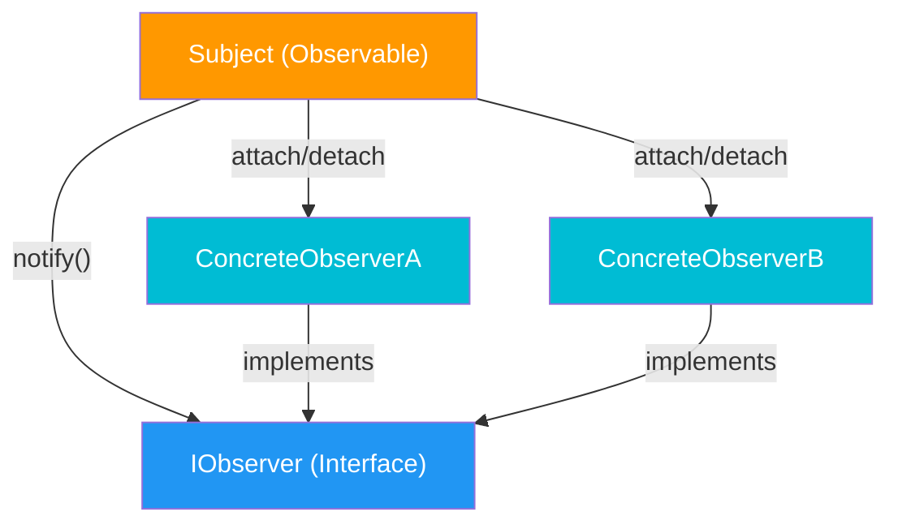

# Observer Design Pattern

## Intent
Define a **one-to-many dependency** between objects so that when one object (Subject) changes state, all its dependents (Observers) are **notified and updated automatically**.

## When to Use
- Multiple objects need to react to state changes in another object.
- You want loose coupling between the object that changes and the objects that respond.
- Event-driven systems: GUI buttons, stock tickers, sensor data, pub-sub messaging.

## Core Structure



## Participants

| Component | Role |
|---|---|
| **Subject (Observable)** | Maintains list of observers; sends notifications on state change |
| **Observer (Interface)** | Defines `update()` method that subjects call |
| **Concrete Observer** | Implements `update()` to react to subject's state change |

## Key Idea in One Line
Subject doesn't know **who** or **how many** observers exist; it just calls `notify()`, and each observer reacts in its own way.

## C++ Design Code (Interview-Friendly)

```cpp
#include <algorithm>
#include <iostream>
#include <memory>
#include <string>
#include <vector>

// ── Observer Interface ──
class IObserver {
public:
    virtual ~IObserver() = default;
    virtual void update(const std::string& message) = 0;
};

// ── Subject (Observable) ──
class NewsPublisher {
    std::vector<std::shared_ptr<IObserver>> subscribers_;
    std::string latestNews_;

public:
    void attach(const std::shared_ptr<IObserver>& observer) {
        subscribers_.push_back(observer);
    }

    void detach(const std::shared_ptr<IObserver>& observer) {
        subscribers_.erase(
            std::remove(subscribers_.begin(), subscribers_.end(), observer),
            subscribers_.end());
    }

    void notify() {
        for (auto& sub : subscribers_) {
            sub->update(latestNews_);
        }
    }

    void publishNews(const std::string& news) {
        latestNews_ = news;
        std::cout << "Publisher: New article -> " << news << "\n";
        notify();
    }
};

// ── Concrete Observers ──
class EmailSubscriber : public IObserver {
    std::string name_;
public:
    explicit EmailSubscriber(std::string name) : name_(std::move(name)) {}
    void update(const std::string& message) override {
        std::cout << "  [Email] " << name_ << " received: " << message << "\n";
    }
};

class AppSubscriber : public IObserver {
    std::string name_;
public:
    explicit AppSubscriber(std::string name) : name_(std::move(name)) {}
    void update(const std::string& message) override {
        std::cout << "  [App]   " << name_ << " received: " << message << "\n";
    }
};

int main() {
    std::cout << "=== Observer Pattern ===\n\n";

    NewsPublisher publisher;

    auto alice = std::make_shared<EmailSubscriber>("Alice");
    auto bob   = std::make_shared<AppSubscriber>("Bob");
    auto carol = std::make_shared<EmailSubscriber>("Carol");

    publisher.attach(alice);
    publisher.attach(bob);
    publisher.attach(carol);

    publisher.publishNews("C++26 Released!");

    std::cout << "\n-- Carol unsubscribes --\n\n";
    publisher.detach(carol);

    publisher.publishNews("Qt 7.0 is out!");
}
```

## Expected Output
```
=== Observer Pattern ===

Publisher: New article -> C++26 Released!
  [Email] Alice received: C++26 Released!
  [App]   Bob received: C++26 Released!
  [Email] Carol received: C++26 Released!

-- Carol unsubscribes --

Publisher: New article -> Qt 7.0 is out!
  [Email] Alice received: Qt 7.0 is out!
  [App]   Bob received: Qt 7.0 is out!
```

## Real-World Mappings
- **Qt Signals & Slots**: Qt's signal-slot mechanism is Observer under the hood
- **Event listeners**: JavaScript DOM events, C# events/delegates
- **Pub-Sub systems**: Redis pub/sub, RabbitMQ, Kafka consumers
- **MVC pattern**: Model (Subject) notifies Views (Observers) on data change
- **Stock ticker**: Price changes notify all watching dashboards

## Benefits
- **Loose coupling**: Subject and observers are independent; subject only knows the interface
- **Open/Closed**: Add new observers without modifying subject code
- **Dynamic subscription**: Observers can attach/detach at runtime
- **Broadcast communication**: One change notifies many listeners automatically

## Trade-offs
- **Memory leaks**: If observers are not properly detached (prevent with `weak_ptr`)
- **Unexpected updates**: Cascading notifications can cause hard-to-debug chains
- **Order dependency**: Notification order is typically undefined
- **Performance**: Too many observers or frequent updates can slow the system

## Observer vs Similar Patterns

| Pattern | Key Difference |
|---|---|
| **Observer** | One-to-many: subject notifies all observers automatically |
| **Mediator** | Many-to-many: central mediator coordinates communication |
| **Event Bus / Pub-Sub** | Decoupled further: publisher and subscriber don't know each other at all |
| **Command** | Encapsulates a request as an object; not about state notification |

## Interview Clarifications

### Quick definition
"Observer defines a one-to-many dependency so that when one object changes state, all dependents are notified and updated automatically."

### Common interview questions
**Q: How is Observer different from Pub-Sub?**  
In Observer, subject directly holds references to observers. In Pub-Sub, there's a message broker/event bus in between — publisher and subscriber don't know each other.

**Q: How to prevent memory leaks?**  
Use `std::weak_ptr` in the subscribers list instead of `std::shared_ptr`, and check validity before calling `update()`.

**Q: Where have you used Observer?**  
"Qt's signal-slot system is essentially Observer. When a button emits `clicked()`, all connected slots are notified."

### Rule of thumb
If you find yourself writing code like "when X changes, also update Y and Z," that's a candidate for Observer.
