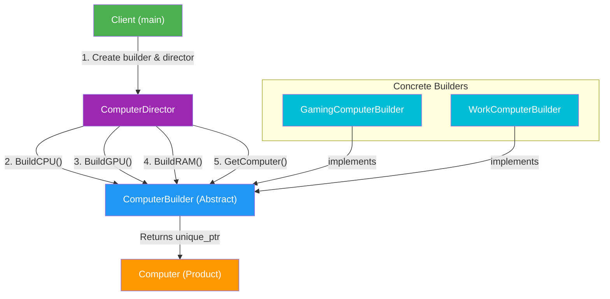

# Builder Design Pattern

## Flow Diagram



## Intent
Separate the **construction** of a complex object from its **representation**, allowing the same construction process to create different representations.

## Participants

| Component | Class | Role |
|---|---|---|
| **Product** | `Computer` | The complex object being built (CPU, GPU, RAM) |
| **Abstract Builder** | `ComputerBuilder` | Interface defining build steps (`BuildCPU`, `BuildGPU`, `BuildRAM`) |
| **Concrete Builder** | `GamingComputerBuilder` | Builds a high-end gaming computer |
| **Concrete Builder** | `WorkComputerBuilder` | Builds an office/work computer |
| **Director** | `ComputerDirector` | Orchestrates the build sequence |

## When to Use
- Object has many optional parameters (avoids telescoping constructors).
- Construction requires multiple steps in a specific order.
- Same construction process should produce different representations.
- You want to isolate construction logic from the product's internal structure.

## Structure
```
Client → Director.BuildComputer(builder)
           → builder.BuildCPU()
           → builder.BuildGPU()
           → builder.BuildRAM()
           → builder.GetComputer() → returns unique_ptr<Computer>
```

## Key Implementation Details
- **Smart pointers**: Builders use `std::unique_ptr<Computer>` and transfer ownership via `std::move()`.
- **Virtual destructor**: `ComputerBuilder` has a virtual destructor for safe polymorphic deletion.
- **Default initialization**: `ram_` is initialized to `0` to avoid undefined behavior.
- **Extensibility**: Adding a new computer type (e.g., `ServerBuilder`) requires no changes to existing code.

## Builder Pattern vs Direct Construction

| Aspect | Direct Construction | Builder Pattern |
|---|---|---|
| Adding a new variant | Modify existing code | Add a new builder class |
| Construction order | Client must know | Director handles it |
| Code reuse | Low | High — director is reusable |
| Testability | Harder | Easy to mock builders |
