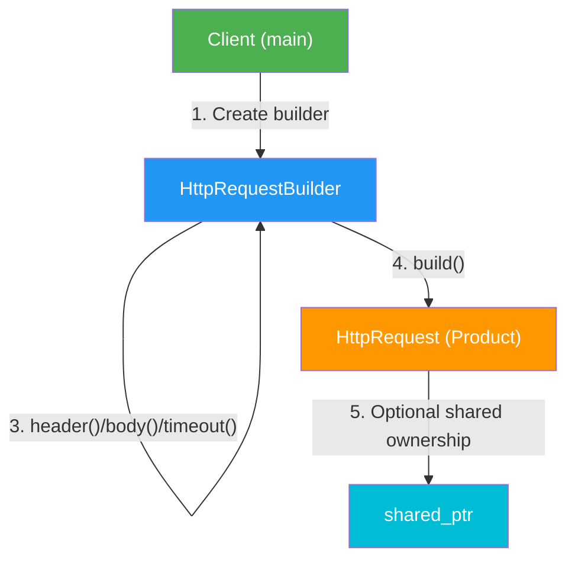

// HTTP Request Builder — Fluent Interface Example

# Fluent HTTP Request Builder

## Overview
A practical implementation of the Builder pattern using C++20's fluent interface for constructing HTTP requests with a clean, intuitive API.

## Key Components

### Product: `HttpRequest`
Represents a complete HTTP request:
- **method** — HTTP method (GET, POST, PUT, DELETE)
- **url** — Request URL
- **headers** — Vector of key-value header pairs
- **body** — Optional request body
- **timeoutMs** — Request timeout in milliseconds
- **print()** — Display request details

### Builder: `HttpRequestBuilder`
Fluent builder with method chaining:
- `get(url)` — Create GET request
- `post(url)` — Create POST request
- `put(url)` — Create PUT request
- `deleteReq(url)` — Create DELETE request
- `header(key, value)` — Add header
- `body(content)` — Set request body
- `timeout(ms)` — Set timeout
- `build()` — Return constructed request as `unique_ptr`

## Mermaid Diagram



## Key Features

### 1. Fluent Interface (Method Chaining)
```cpp
auto request = HttpRequestBuilder{}
    .get("https://api.example.com/users")
    .header("Accept", "application/json")
    .header("Authorization", "Bearer token")
    .timeout(3000)
    .build();
```

### 2. C++20 Features Used
- **`std::optional<std::string>`** — For optional body field
- **`std::string_view`** — For parameter views (zero-copy)
- **`std::format`** — For type-safe output formatting
- **`std::unique_ptr`** — For automatic memory management
- **`[[nodiscard]]`** — Compiler warning if build() result is ignored
- **Structured bindings** — `for (const auto &[k, v] : headers)`

### 3. Ownership & Memory Management
```cpp
// build() returns unique_ptr - caller owns the object
auto uptr = HttpRequestBuilder{}.get("url").build();

// Can convert to shared_ptr if needed
std::shared_ptr<HttpRequest> sptr = HttpRequestBuilder{}.get("url").build();
```

### 4. Smart Defaults
- Default timeout: 5000ms
- Method chaining returns `*this` for fluency
- Body is optional (uses `std::optional`)

## Usage Examples

### GET Request
```cpp
auto getReq = HttpRequestBuilder{}
    .get("https://api.example.com/users")
    .header("Accept", "application/json")
    .header("Authorization", "Bearer token123")
    .timeout(3000)
    .build();
```

### POST with JSON
```cpp
auto postReq = HttpRequestBuilder{}
    .post("https://api.example.com/users")
    .header("Content-Type", "application/json")
    .body(R"({"name":"Alice","age":30})")
    .build();
```

### Shared Ownership
```cpp
std::shared_ptr<HttpRequest> shared = HttpRequestBuilder{}
    .get("https://api.example.com/health")
    .timeout(1000)
    .build();
    
auto copy = shared;  // Both own the same request
std::cout << shared.use_count();  // Prints: 2
```

## Design Patterns Applied

| Pattern | How Used |
|---------|----------|
| **Builder** | Separate construction from representation |
| **Fluent Interface** | Method chaining for readability |
| **RAII** | Automatic cleanup with smart pointers |

## Benefits

| Benefit | Reason |
|---------|--------|
| **Readability** | Clear, self-documenting code |
| **Flexibility** | Optional components, no constructor overloading |
| **Type Safety** | C++20 `std::format`, compile-time checks |
| **Memory Safety** | Smart pointers prevent leaks |
| **Simplicity** | No concrete builders needed, single class |

## Compilation

```bash
g++ -std=c++20 -o http_request HTTPRequestBuilder.cpp
./http_request
```

## Real-World Applications

- HTTP client libraries (curl, libhttppp)
- REST API clients
- Web scraping frameworks
- Microservice communication
- Testing frameworks for HTTP APIs

## Interview Clarifications

### Is this example correct Builder usage?
Yes. This is a valid **Builder + Fluent Interface** example.

### Does Builder only mean creating different object types?
No. Builder primarily separates **construction logic** from the final object representation.
Creating different variants is a common benefit, but not the only goal.

### Why is one product class (`HttpRequest`) still enough?
"Complex object" means the object has multiple configurable parts and construction steps, not necessarily multiple product classes.
In this example, complexity comes from:
- Required and optional fields (`method`, `url`, optional `body`, headers, timeout)
- Many valid combinations (GET without body, POST with body, custom headers, etc.)
- Step-by-step readable construction through chaining

### Quick interview line
"Builder is useful when a single object has complex or step-wise construction, and we want readable object creation while keeping construction logic separate from the object."

## Comparison: Procedural vs Builder

### Without Builder (Procedural)
```cpp
HttpRequest req;
req.method = "POST";
req.url = "https://api.example.com/users";
req.headers.push_back({"Content-Type", "application/json"});
req.headers.push_back({"Authorization", "Bearer token"});
req.body = R"({"name":"Alice"})";
req.timeoutMs = 5000;
```

### With Builder (Fluent)
```cpp
auto req = HttpRequestBuilder{}
    .post("https://api.example.com/users")
    .header("Content-Type", "application/json")
    .header("Authorization", "Bearer token")
    .body(R"({"name":"Alice"})")
    .timeout(5000)
    .build();
```

The builder approach is:
- ✅ More readable
- ✅ Self-documenting
- ✅ Prevents invalid intermediate states
- ✅ Clear intent with `get()`, `post()` methods

