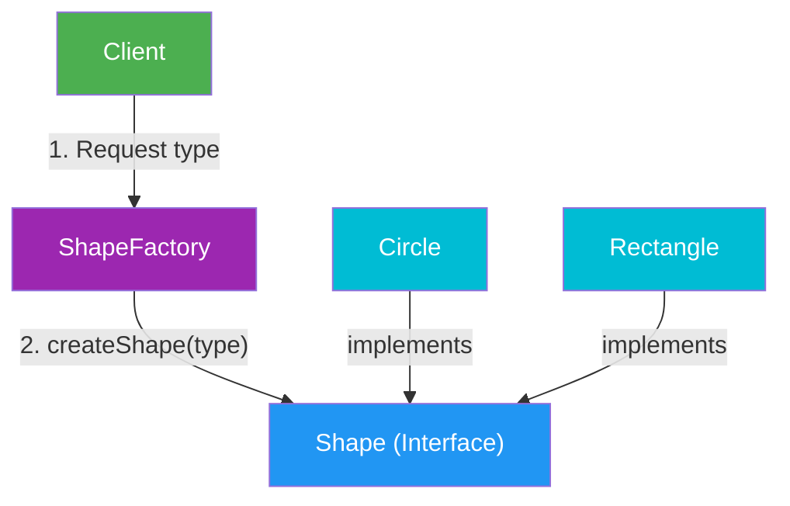

# Factory Design Pattern

## Intent
Create objects through a **factory method** instead of creating them directly with `new` in client code.

Factory helps you hide object-creation logic and return objects via a common interface.

## Flow Diagram



## Problem (Without Factory)
When client code directly creates objects:
- It depends on concrete classes.
- It needs `if/else` or `switch` in many places.
- Adding a new type requires updates in multiple files.

## Solution (With Factory)
Move creation logic into one place (`ShapeFactory`).
Client asks the factory for an object by type, and factory returns `std::unique_ptr<Shape>`.

## Participants

| Component | Role |
|---|---|
| **Product** | Common interface/base class (e.g., `Shape`) |
| **Concrete Products** | Actual implementations (e.g., `Circle`, `Rectangle`) |
| **Factory** | Decides and creates the correct concrete object |
| **Client** | Uses product interface, not concrete classes |

## Minimal C++ Example

```cpp
#include <iostream>
#include <memory>
#include <string>

class Shape {
public:
	virtual ~Shape() = default;
	virtual void draw() const = 0;
};

class Circle : public Shape {
public:
	void draw() const override { std::cout << "Drawing Circle\n"; }
};

class Rectangle : public Shape {
public:
	void draw() const override { std::cout << "Drawing Rectangle\n"; }
};

class ShapeFactory {
public:
	static std::unique_ptr<Shape> createShape(const std::string& type) {
		if (type == "circle") return std::make_unique<Circle>();
		if (type == "rectangle") return std::make_unique<Rectangle>();
		return nullptr;
	}
};

int main() {
	auto shape = ShapeFactory::createShape("circle");
	if (shape) shape->draw();
}
```

## When to Use
- Object creation logic is repeated in many places.
- Client should not know concrete class names.
- You expect new product types in the future.

## Benefits
- **Loose coupling**: Client depends on interface, not concrete class.
- **Single creation point**: Easier maintenance.
- **Extensible design**: New products can be added with minimal client changes.

## Trade-offs
- Adds one more abstraction layer.
- Simple projects may not need it.
- If factory becomes too large, split into multiple factories.

## Factory vs Builder (Interview)
- **Factory**: Chooses and creates **which object** to return.
- **Builder**: Controls **how an object is built step-by-step**.

## Interview Clarifications

### Quick definition
"Factory pattern centralizes object creation and returns objects through a common interface, reducing client-side coupling."

### Common interview question
**Q: What changes when a new product is added?**  
Add a new concrete class and update factory creation logic. Client code usually remains unchanged.

### Rule of thumb
If your code has many `new ConcreteType(...)` decisions spread across modules, consider Factory.

