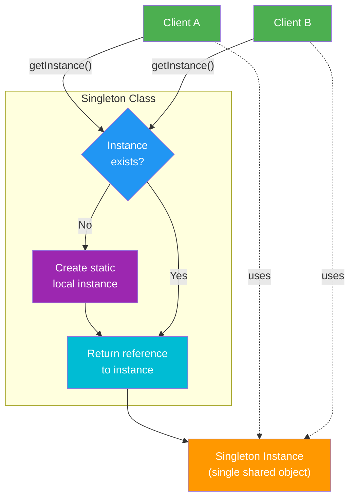

# Singleton Design Pattern

## Flow Diagram



## Intent
Ensure a class has **exactly one instance** and provide a global access point to it.

## Key Characteristics

| Property | Detail |
|---|---|
| **Instances** | Exactly one, for the lifetime of the program |
| **Access** | Global via a static method |
| **Construction** | Lazy — created on first call to `getInstance()` |
| **Destruction** | Automatic at program exit (static local) |
| **Thread Safety** | Guaranteed by C++11 standard |

## Modern C++ Implementation (Meyer's Singleton)
```cpp
class Singleton {
public:
    static Singleton& instance() {
        static Singleton inst;  // thread-safe in C++11+
        return inst;
    }
    Singleton(const Singleton&) = delete;
    Singleton& operator=(const Singleton&) = delete;
    Singleton(Singleton&&) = delete;
    Singleton& operator=(Singleton&&) = delete;
private:
    Singleton() = default;
};
```

## Why Meyer's Singleton?

| Approach | Thread Safe? | Memory Leak? | Complexity |
|---|---|---|---|
| Raw `new` + static pointer | No (race condition) | Yes (manual `delete`) | High |
| Double-checked locking | Yes (if done right) | Yes | Very High |
| **Static local (Meyer's)** | **Yes (C++11)** | **No (auto cleanup)** | **Low** |

## Thread Safety
- C++11 guarantees **static local variable initialization is thread-safe**.
- No need for double-checked locking or mutexes.
- The compiler handles synchronization internally.

## When to Use
- Logging systems
- Configuration / settings managers
- Connection pools and caches
- Hardware interface access (e.g., game settings, printer spooler)

## When NOT to Use
- When testability matters (hard to mock).
- Consider dependency injection instead.
- Singletons are essentially global state — use sparingly.
- In multithreaded code where the singleton holds mutable shared state without its own locking.

## Alternatives
- **Dependency injection** (preferred for testability).
- `inline` global variable (C++17).
- **Monostate pattern** — all instances share static state, but allow multiple "instances".
