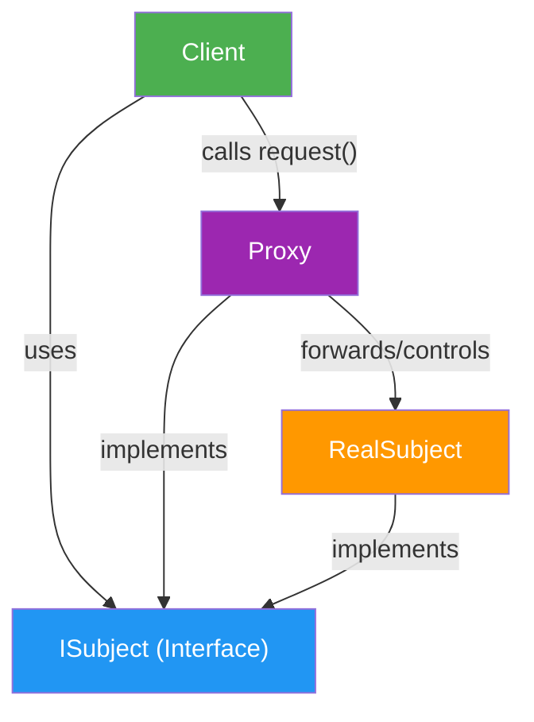

# Proxy Design Pattern

## Intent
Provide a **surrogate (placeholder)** object that controls access to another object.

A Proxy has the same interface as the real object, but adds logic such as:
- lazy loading
- access control
- logging
- caching
- remote call forwarding

## Why Proxy?
Use Proxy when direct access to an object is expensive, unsafe, or needs extra behavior.

Typical examples:
- Loading a large image/file only when needed (Virtual Proxy)
- Role-based permission checks (Protection Proxy)
- Calling an object on another machine/process (Remote Proxy)
- Caching repeated responses (Caching Proxy)

## Core Structure



## Participants

| Component | Role |
|---|---|
| **Subject** | Common interface used by client |
| **RealSubject** | Actual object that does real work |
| **Proxy** | Controls access to `RealSubject`; may create and forward lazily |
| **Client** | Depends only on `Subject` interface |

## Key Idea in One Line
Client talks to Proxy exactly as if it were the real object; Proxy decides **when/how** to call the real object.

## C++ Design Code (Interview-Friendly)

```cpp
#include <iostream>
#include <memory>
#include <string>
#include <unordered_map>

class IImage {
public:
	virtual ~IImage() = default;
	virtual void display() = 0;
};

class RealImage : public IImage {
	std::string fileName_;

	void loadFromDisk() {
		std::cout << "Loading image from disk: " << fileName_ << "\n";
	}

public:
	explicit RealImage(std::string fileName) : fileName_(std::move(fileName)) {
		loadFromDisk();
	}

	void display() override {
		std::cout << "Displaying image: " << fileName_ << "\n";
	}
};

class ImageProxy : public IImage {
	std::string fileName_;
	std::unique_ptr<RealImage> realImage_;  // lazy creation
	bool hasAccess_{true};                  // simple protection check

public:
	explicit ImageProxy(std::string fileName, bool hasAccess = true)
		: fileName_(std::move(fileName)), hasAccess_(hasAccess) {}

	void display() override {
		std::cout << "[Proxy] Request to display image\n";

		if (!hasAccess_) {
			std::cout << "[Proxy] Access denied\n";
			return;
		}

		if (!realImage_) {
			std::cout << "[Proxy] Lazy-loading RealImage\n";
			realImage_ = std::make_unique<RealImage>(fileName_);
		}

		realImage_->display();
	}
};

int main() {
	std::cout << "=== Proxy Pattern ===\n\n";

	IImage* img = nullptr;

	ImageProxy allowed("profile_photo.png", true);
	img = &allowed;
	img->display();  // loads + displays
	img->display();  // displays only (already loaded)

	std::cout << "\n";

	ImageProxy denied("secret.png", false);
	img = &denied;
	img->display();  // blocked by proxy
}
```

## Remote Proxy Example (Additional)
Use a proxy as a local representative for a remote service call.

In this repository, see:
- [StructuralDesignPattern/RemoteProxyDesignPattern.cpp](StructuralDesignPattern/RemoteProxyDesignPattern.cpp)

What it demonstrates:
- `IWeatherService` as common interface
- `RemoteWeatherService` as real remote object
- `WeatherServiceProxy` adding request counting/rate-limiting before forwarding

## How to Explain in Interview
"Proxy keeps the same interface as the real object and adds control logic before delegating. In this example, it performs access check and lazy loading so expensive object creation is deferred until first use."

## Real-World Mappings
- **Virtual Proxy**: image/document thumbnails, large report generation
- **Protection Proxy**: user role checks before sensitive operations
- **Remote Proxy**: client stub in RPC/gRPC-like architecture
- **Caching Proxy**: API gateway returning cached responses

## Benefits
- Reduces unnecessary heavy object creation (performance)
- Adds security checks without changing real object code
- Improves separation of concerns
- Keeps client code stable via interface abstraction

## Trade-offs
- Adds extra indirection and complexity
- Debugging call flow can be slightly harder
- Too many proxy responsibilities can violate SRP; split when needed

## Proxy vs Similar Patterns
- **Proxy**: controls access to same interface object
- **Decorator**: adds behavior dynamically, focuses on feature extension
- **Adapter**: converts one interface into another
- **Facade**: provides simplified interface to a subsystem

## Common Interview Q&A
**Q: Is proxy only for security?**  
No. Security is one type; proxy is also used for lazy loading, caching, logging, and remote access.

**Q: Does client know real object?**  
Ideally no. Client should depend on the common interface.

**Q: When not to use Proxy?**  
If object creation is cheap and no access control/caching/lazy behavior is needed, proxy may be unnecessary overhead.

